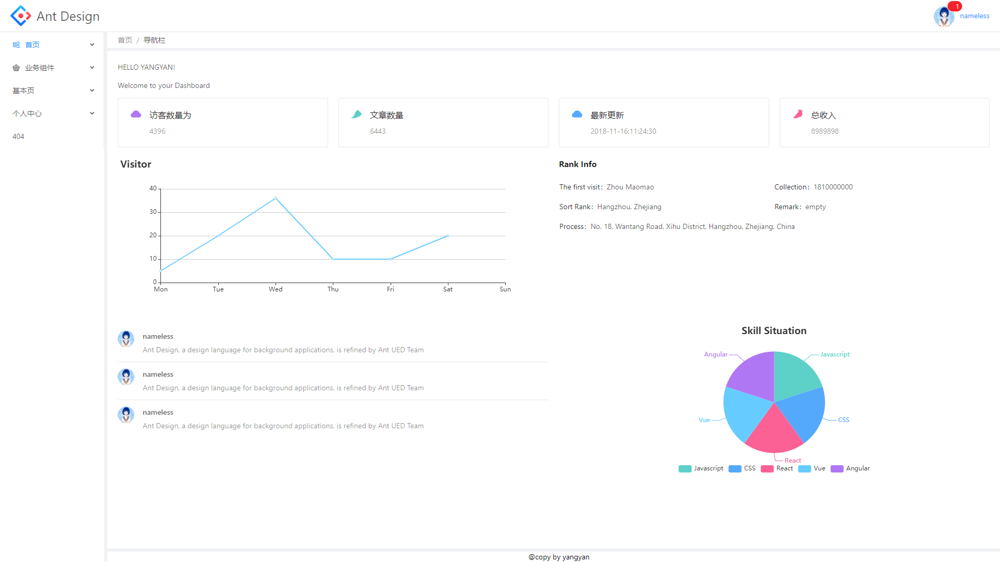
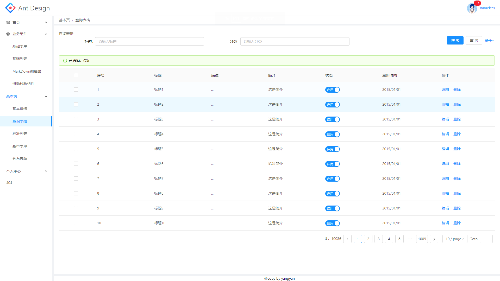
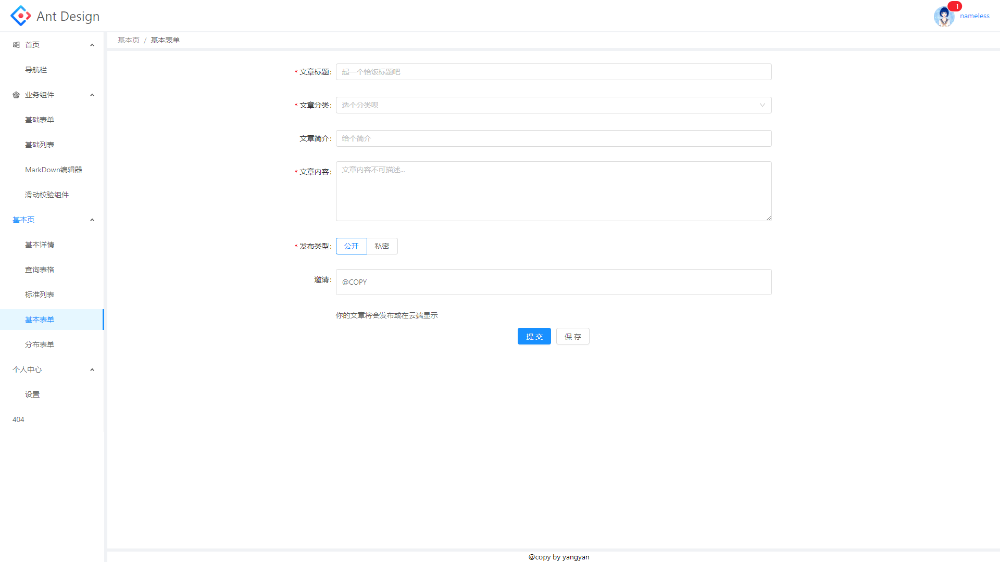

# 项目简介
本项目是一款基于`React + antd + webpack+ Redux `开发的后台管理系统,并作为开发用的前端壳工程.







# 说明
> 如果对您对此项目有兴趣，可以点 "Star" 支持一下 谢谢！ ^_^


# 技术栈

功能 | 依赖
- | - 
UI设计 | Antd
SPA | React
状态管理  | Redux 
网络请求 | axios 

# 项目运行

```js
yarn install (cnpm 也可以) 

npm run dev (开发环境构建)

npm run build(生产环境构建)
```

# 线上地址
[点击这里跳转]('https://www.zdxhyangyan.cn/example/frontend_react_admin/')

# 项目特点

- 集成基本表单业务组件
- 集成基本列表业务组件
- 集成MarkDown编辑器
- 继承滑动校验组件(本地环境无法访问)
- 集成token 以及权限校验功能
- 集成redux持久化服务
